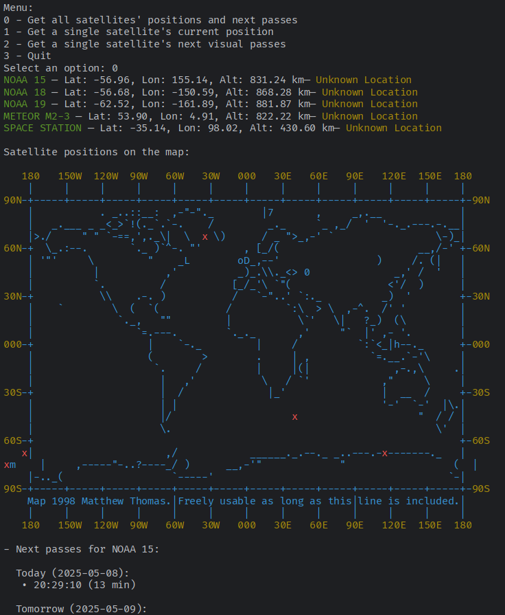
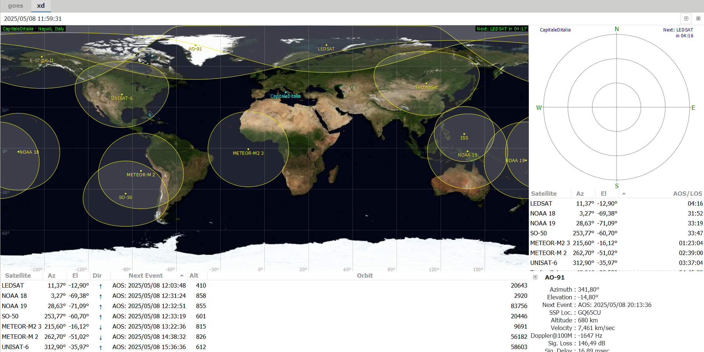
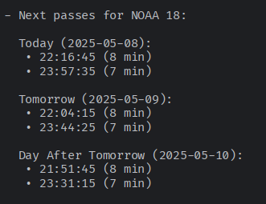

# Satellite Predictor & Tracker
Satellite tracker using the N2YO api, it shows real-time satellite positions on an ASCII world map and predicts the next visible passes from your location for the next few days

 

# 💻 Code
The code starts with a simple menu that gives you 3 options:
- Pick one satellite and see their current position on a map;
- Pick one satellite and see their next visible passes over your location;
- Take all satellites in the database and see both their position and next visible passes;
  
The code uses n2yo api to get the data, the passes are considered visibile if they happen at a certain angle and for a certain amount of time.

The map is an ASCII drawing i found online, the satellite position on the map is calculated and a pin is put there, the accuracy is sometimes very low. 

Above the map the satellite coordinates are printed, as well as an estimate of what country the satellite is directly above.

# 🛰 Next Passes Predictor 

  The prediction is as i said before made by n2yo api, but in order for the code to work you must first manually add your coordinates and the list of satellites you are interested in next to their n2yo id. 

The api shows you the predictions for the next few days, which is something that softares like gpredict do not do, at best they give you the next visible pass and thats'it.

Also gpredict is sometimes laggy and slow, and doesn't allow the user to remove the ranges of the satellites in the map picture, which consumes for some reason lots of resources and can be a problem when having multiple softwares opened (for example sdrpp or satdump if you are actively scanning satellites).  

Here's an example of a simple next passes prediction -->
